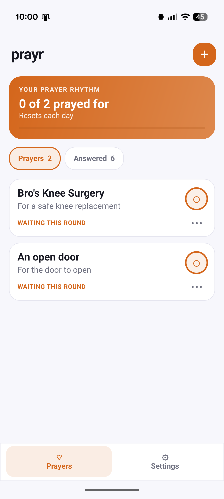

<h1>prayr 🙏</h1>

<strong>A simple Android prayer companion by blondothenerd.</strong>

  prayr helps keep prayer requests in rotation without turning them into another productivity dashboard.

  
  

 

  

  

<h2>✨ What it does</h2>

<ul>
  <li>Add prayer requests with <strong>Pray for</strong>, <strong>Reason</strong>, and <strong>Specifics</strong>.</li>
  <li>Mark <strong>Done</strong> when a prayer has been prayed in the current cycle.</li>
  <li>Mark <strong>Completed</strong> manually when a prayer is no longer active.</li>
  <li>Automatically begin a fresh cycle after all active prayers have been prayed.</li>
  <li>Choose <strong>random</strong> or <strong>sequential</strong> prayer selection.</li>
  <li>Configure notification timing by <strong>interval</strong> or <strong>randomised frequency</strong>.</li>
  <li>Configure a daily notification window and notification count.</li>
  <li>Use notification actions such as <strong>Done</strong> and <strong>Snooze</strong>.</li>
  <li>Keep the experience intentionally small, quiet, and focused.</li>
</ul>

<h2>🚗 Android Auto</h2>

  The public project uses normal Android notification behaviour. It does not impersonate a messaging,
  calendar, or other restricted app category to gain access to Android Auto surfaces.

<h2>🔨 Build</h2>

<h3>Requirements</h3>

<ul>
  <li>Android Studio</li>
  <li>JDK 17</li>
  <li>Android SDK matching the project's configured compile SDK</li>
</ul>

<h3>Command line</h3>

<pre><code>./gradlew clean
./gradlew lint
./gradlew testDebugUnitTest
./gradlew assembleDebug</code></pre>

The debug APK will normally be written beneath:

<pre><code>app/build/outputs/apk/debug/</code></pre>

<h2>👨‍💻 Project</h2>

<table>
  <tr>
    <th align="left">Item</th>
    <th align="left">Value</th>
  </tr>
  <tr>
    <td>Project</td>
    <td><code>prayr</code></td>
  </tr>
  <tr>
    <td>Author / maintainer</td>
    <td><strong>blondothenerd</strong></td>
  </tr>
  <tr>
    <td>Package ID</td>
    <td><code>dev.blondothenerd.prayr</code></td>
  </tr>
  <tr>
    <td>Repository</td>
    <td><code>blondothenerd/prayr</code></td>
  </tr>
  <tr>
    <td>License</td>
    <td>MIT</td>
  </tr>
</table>

<h2>🔐 Privacy</h2>

  Prayer content can be deeply personal. The public build is intended to remain local-first and avoid
  analytics, advertising, remote logging, or cloud synchronisation unless those features are explicitly
  documented and opt-in.

See <a href="PRIVACY.md">PRIVACY.md</a>.

<h2>🤝 Contributing</h2>

  Issues and pull requests are welcome. See <a href="CONTRIBUTING.md">CONTRIBUTING.md</a>.

<h2>📄 License</h2>

  Released under the MIT License. See <a href="LICENSE">LICENSE</a>.

  
Made by <strong>blondothenerd</strong> 🙏

